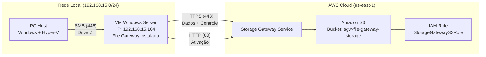

# Arquitetura — AWS File Gateway (SMB)

## Topologia de Rede



## Componentes

| Componente | Função | IP / Recurso |
|------------|--------|--------------|
| **PC Host** | Máquina física que roda Hyper-V e acessa o compartilhamento SMB | 192.168.15.x |
| **VM Windows Server** | Hospeda o File Gateway; serve o compartilhamento SMB | 192.168.15.104 |
| **File Gateway** | Software da AWS instalado na VM; faz ponte entre SMB e S3 | Instalado na VM |
| **Amazon S3** | Armazenamento real dos arquivos na nuvem | Bucket: `sgw-file-gateway-storage` |
| **IAM Role** | Permissões para o gateway acessar o bucket S3 | `StorageGatewayS3Role` |

## Fluxo de Dados

### Escrita (PC → S3)

```
PC Host                    VM Windows Server              AWS
┌──────────┐              ┌──────────────────┐          ┌──────────┐
│           │              │                  │          │          │
│ Salvar    │───SMB 445───▶│  Cache Local     │──HTTPS──▶│  Bucket  │
│ arquivo   │              │  (File Gateway)  │   443    │    S3    │
│ em Z:\    │              │                  │          │          │
└──────────┘              └──────────────────┘          └──────────┘
```

1. Você salva um arquivo em `Z:\documento.pdf`
2. O File Gateway na VM recebe via SMB
3. Armazena no cache local da VM
4. Faz upload para o bucket S3 `sgw-file-gateway-storage` (em até 60 segundos)
5. O arquivo aparece como objeto no S3: `s3://sgw-file-gateway-storage/documento.pdf`

### Leitura (S3 → PC)

```
PC Host                    VM Windows Server              AWS
┌──────────┐              ┌──────────────────┐          ┌──────────┐
│           │              │                  │          │          │
│ Abrir     │◀──SMB 445───│  Cache Local     │◀──HTTPS──│  Bucket  │
│ arquivo   │              │  (File Gateway)  │   443    │    S3    │
│ de Z:\    │              │                  │          │          │
└──────────┘              └──────────────────┘          └──────────┘
```

1. Você abre `Z:\documento.pdf`
2. Se o arquivo está no cache da VM → entrega imediata (rápido)
3. Se não está no cache → File Gateway baixa do S3 → guarda no cache → entrega

## Portas de Comunicação

| Origem | Destino | Porta | Protocolo | Finalidade |
|--------|---------|-------|-----------|------------|
| PC Host | VM Windows Server | 445 | SMB | Acesso ao compartilhamento |
| VM Windows Server | AWS | 443 | HTTPS | Transferência de dados para S3 |
| VM Windows Server | AWS | 80 | HTTP | Ativação do gateway (apenas 1 vez) |

## Segurança

- **SMB**: Autenticação por guest — em produção usar Active Directory
- **AWS**: Comunicação via HTTPS (criptografada) entre VM e S3
- **IAM**: Role com permissões mínimas (s3:GetObject, s3:PutObject, s3:ListBucket, s3:DeleteObject)
- **Rede**: Portas 80, 443 e 445 devem estar liberadas no firewall da VM
