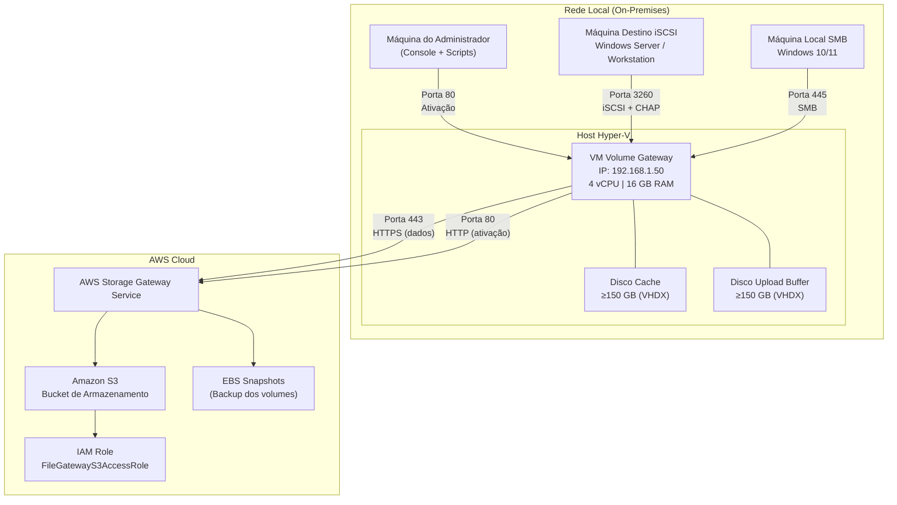
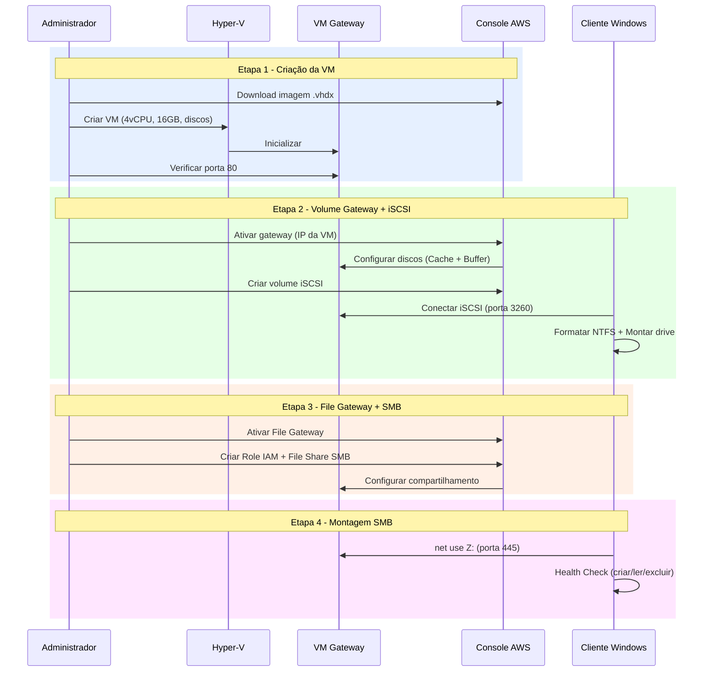

# Arquitetura — AWS Storage Gateway

## Topologia de Rede



## Componentes do Sistema

| Componente | Função | Localização |
|------------|--------|-------------|
| **VM Volume Gateway** | Appliance virtual que gerencia volumes iSCSI com cache local e upload assíncrono para AWS | Host Hyper-V (on-premises) |
| **VM File Gateway** | Appliance virtual que expõe buckets S3 como compartilhamentos SMB | Host Hyper-V (on-premises) |
| **Disco Cache** | Armazena localmente os dados acessados com frequência para leitura rápida | Disco VHDX na VM |
| **Disco Upload Buffer** | Buffer temporário para dados pendentes de upload para a AWS | Disco VHDX na VM |
| **iSCSI Initiator** | Cliente que conecta ao volume iSCSI e o apresenta como disco local | Máquina destino Windows |
| **Cliente SMB** | Monta o compartilhamento de rede exposto pelo File Gateway | Máquina local Windows |
| **AWS Storage Gateway Service** | Serviço gerenciado que coordena a replicação de dados entre on-premises e AWS | AWS Cloud |
| **Amazon S3** | Armazenamento de objetos que serve como backend do File Gateway | AWS Cloud |
| **EBS Snapshots** | Backups point-in-time dos volumes do Volume Gateway | AWS Cloud |
| **IAM Role** | Permissões para o File Gateway acessar o bucket S3 | AWS Cloud |

## Fluxo de Dados

### Volume Gateway (Cached Volumes)

```
┌──────────────┐      ┌───────────────────────────────────┐      ┌─────────────┐
│   Aplicação  │      │         VM Volume Gateway         │      │  AWS Cloud  │
│   (iSCSI)    │      │                                   │      │             │
│              │      │  ┌───────────┐   ┌─────────────┐  │      │  ┌───────┐  │
│  Escrita ────────────▶│   Cache   │──▶│Upload Buffer│──────────▶│  EBS/S3 │  │
│              │      │  │  (150GB)  │   │  (150GB)    │  │      │  │Snapshot│  │
│  Leitura ◀───────────│           │   │             │  │      │  └───────┘  │
│              │      │  └───────────┘   └─────────────┘  │      │             │
└──────────────┘      └───────────────────────────────────┘      └─────────────┘
       │                                                                │
       │                    Porta 3260 (iSCSI)                         │
       │                                                    Porta 443 (HTTPS)
```

**Fluxo de escrita:**
1. A aplicação escreve no disco iSCSI (porta 3260)
2. Os dados são gravados no **Disco Cache** da VM
3. Os dados são copiados para o **Upload Buffer**
4. O gateway faz upload assíncrono para a AWS (porta 443)
5. Os dados ficam disponíveis como EBS Snapshots

**Fluxo de leitura:**
1. A aplicação lê do disco iSCSI
2. Se os dados estão no **Cache** → leitura local (rápida)
3. Se os dados não estão no Cache → download da AWS → armazenamento no Cache → entrega

### File Gateway (SMB)

```
┌──────────────┐      ┌───────────────────────────────────┐      ┌─────────────┐
│   Usuário    │      │          VM File Gateway          │      │  AWS Cloud  │
│   (SMB)      │      │                                   │      │             │
│              │      │  ┌───────────┐                    │      │  ┌───────┐  │
│  Escrita ────────────▶│   Cache   │─────────────────────────▶│    S3   │  │
│              │      │  │  (150GB)  │                    │      │  │ Bucket │  │
│  Leitura ◀───────────│           │◀────────────────────────│         │  │
│              │      │  └───────────┘                    │      │  └───────┘  │
└──────────────┘      └───────────────────────────────────┘      └─────────────┘
       │                                                                │
       │                    Porta 445 (SMB)                            │
       │                                                    Porta 443 (HTTPS)
```

**Fluxo de escrita:**
1. O usuário cria/modifica arquivo no compartilhamento SMB (porta 445)
2. O arquivo é armazenado no **Cache** local
3. O File Gateway sincroniza com o **Bucket S3** (em até 60 segundos)
4. O arquivo fica disponível diretamente no S3 como objeto

**Fluxo de leitura:**
1. O usuário acessa arquivo pelo compartilhamento SMB
2. Se está no **Cache** → entrega local (rápida)
3. Se não está no Cache → download do S3 → armazena no Cache → entrega

## Interfaces de Comunicação

| Origem | Destino | Porta | Protocolo | Autenticação | Propósito |
|--------|---------|-------|-----------|--------------|-----------|
| Admin | VM Gateway | 80 | HTTP | Nenhuma | Ativação inicial no Console AWS |
| VM Gateway | AWS Endpoints | 443 | HTTPS/TLS | IAM (SigV4) | Transferência de dados e controle |
| Cliente iSCSI | VM Gateway | 3260 | iSCSI | CHAP (mutual) | Acesso ao volume como disco local |
| Cliente SMB | VM Gateway | 445 | SMB 2.x/3.x | Guest ou AD | Acesso ao compartilhamento de arquivos |
| VM Gateway | NTP Server | 123 | UDP | Nenhuma | Sincronização de relógio |
| VM Gateway | DNS Server | 53 | UDP/TCP | Nenhuma | Resolução de nomes AWS |

## Considerações de Segurança

- **iSCSI**: Autenticação CHAP mútua obrigatória; tráfego na rede local (não expor à internet)
- **SMB**: Usar Active Directory em produção; Guest apenas para lab/teste
- **AWS**: Princípio do menor privilégio — a Role IAM do File Gateway tem apenas permissões S3 necessárias
- **Rede**: VM Gateway deve ter acesso restrito — apenas portas necessárias liberadas
- **Credenciais**: Armazenadas em `config/variaveis.env` — não versionar este arquivo com senhas reais (adicionar ao `.gitignore`)

## Diagrama de Implantação (Sequência)


